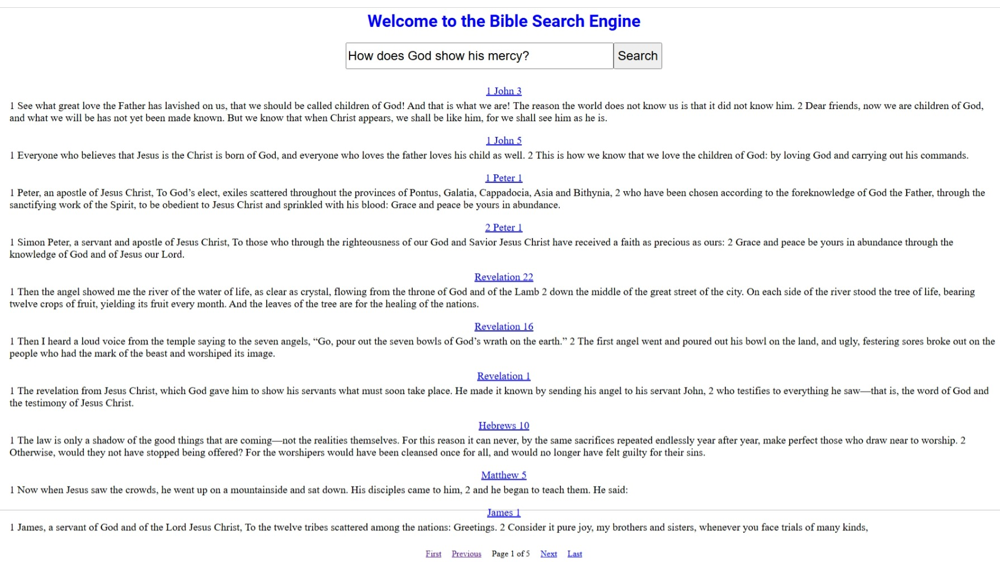
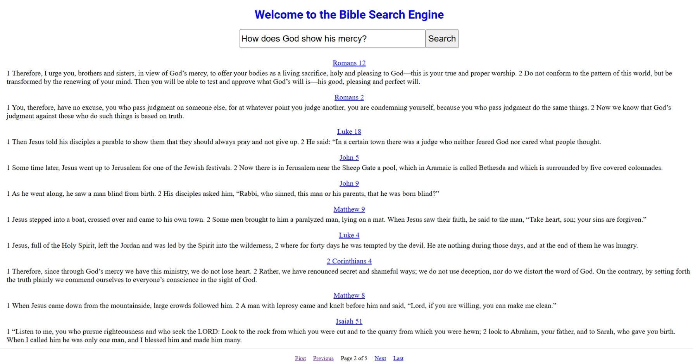

# Bible Search Engine Website
The link to the search engine is [https://ronenhuang24.azurewebsites.net/bible-search](https://ronenhuang24.azurewebsites.net/bible-search).

## Author
Ronen Huang

## Time Frame
March 2025 - April 2025 (add search interface with Django)

## Data Source
The web pages for each book of the New International Version Bible can be accessed via [https://www.biblestudytools.com/](https://www.biblestudytools.com/).

## Bible Search Engine Backend
The backend for the Bible search engine ([link to Repo](https://github.com/ronenh24/bible_search_engine), [link to PyPI](https://pypi.org/project/bible-search-engine/)) incorporates Natural Language Processing, Deep Learning, and Machine Learning. It can be downloaded via.
```commandline
pip install bible-search-engine
```

## Example
To search for the query "How does God show his mercy?", type it in the search bar and click search. It will return the ranked results with 10 per page.



## Planned Improvements
- Decrease Memory Usage
- Track Online Interactions
